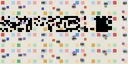
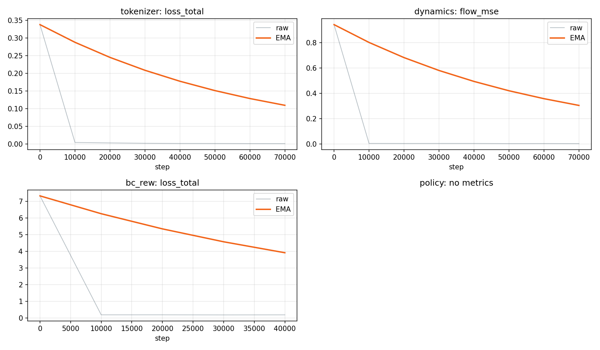
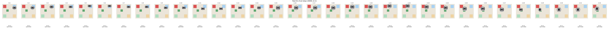
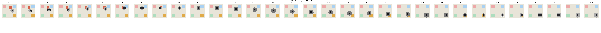

# Dreamer4-JAX for 2.5D Visual Grasping (Interview Portfolio Version)

## Project Snapshot

This project is an unofficial JAX implementation of core Dreamer4 training mechanisms, extended to a robotics-inspired **2.5D top-down grasping environment**.  
I completed end-to-end training and evaluation on the `grasping_2p5d` path and organized the pipeline for reproducible multi-stage runs.

In one line: this is a world-model RL project that goes from visual tokenization to imagination-based policy learning, with concrete grasping results and reproducible artifacts.


## What I Built for 2.5D Grasping

- Built and validated the full 4-stage training pipeline on the grasping environment:
  - tokenizer pretraining
  - dynamics/world-model training
  - behavior cloning + reward heads
  - imagination-based policy optimization
- Integrated environment-aware routing so the same pipeline supports:
  - `bouncing_square` (toy baseline for mechanism sanity checks)
  - `grasping_2p5d` (main interview target)
- Produced structured run artifacts for reproducibility:
  - resolved configs
  - checkpoints per stage
  - metrics streams
  - visual diagnostics
  - final run summaries

## Environment Brief (2.5D Grasping)

The main environment is implemented in `dreamer/grasping_env.py` and routed through `dreamer/envs.py`.

- Observation: top-down RGB frames
- Action space: discrete action vocabulary (`ACTION_DIM = 8`) plus null action handling in pipeline/model wiring
- Tasks: goal-conditioned setup with `task_ids` (multi-task training and evaluation)
- Objective signals: grasping and placement oriented rewards with diagnostics exposed in pipeline reporting

This design intentionally targets mechanism-level validation for world-model RL in manipulation-like settings, rather than claiming a full real-robot benchmark reproduction.

## Implementation Flow (Code and Data Path)

Unified entrypoint:

```bash
python -m dreamer.pipeline <command> ...
```

Main commands:

- `run`: full pipeline (`tokenizer -> dynamics -> bc_rew -> policy -> eval -> report`)
- `resume`: continue from an interrupted run directory
- `stage-only`: run a single stage for focused debugging/validation

Configuration source of truth:

- `configs/base.yaml`
- `configs/profiles/quick_test.yaml`
- `configs/profiles/production.yaml`
- `configs/profiles/production_policy_recover.yaml`

Environment/task routing:

- `dreamer/envs.py` selects toy vs grasping specs and batch unpacking behavior
- `dreamer/grasping_env.py` provides grasping rollout dynamics and task-conditioned batches

Typical artifact layout:

```text
runs/<experiment_name>/<timestamp>/
  config_resolved.yaml
  manifest.json
  summary.md
  tokenizer/
  dynamics/
  bc_rew/
  policy/
  metrics/
```

## Reproducible Training

### Option A: Google Colab (recommended for accessible reproducibility)

Setup:

```bash
git clone https://github.com/Irayshon/Dreamer4-jax.git
cd Dreamer4-jax
pip install uv
uv sync
uv pip install -e .
pip uninstall -y jax jaxlib jax-cuda12-plugin jax-cuda12-pjrt
pip install -r requirements-colab.txt
```

Run:

```bash
python -m dreamer.pipeline run --config configs/profiles/quick_test.yaml --output-root /content/drive/MyDrive/Dreamer4Runs
python -m dreamer.pipeline run --config configs/profiles/production.yaml --output-root /content/drive/MyDrive/Dreamer4Runs
```

Resume:

```bash
python -m dreamer.pipeline resume --run-dir /content/drive/MyDrive/Dreamer4Runs/<experiment_name>/<timestamp>
```

### Option B: A100 (production-oriented)

Setup:

```bash
uv sync
uv pip install -e .
pip uninstall -y jax jaxlib jax-cuda12-plugin jax-cuda12-pjrt
pip install -r requirements-local-gpu.txt
```

Run production profile:

```bash
python -m dreamer.pipeline run --config configs/profiles/production.yaml
```

Policy recovery/extension run:

```bash
python -m dreamer.pipeline run --config configs/profiles/production_policy_recover.yaml
```

Resume from checkpointed run:

```bash
python -m dreamer.pipeline resume --run-dir runs/<experiment_name>/<timestamp>
```

### A100 Runtime Note

For a single A100 (40GB class), end-to-end production runs are expected on the order of multiple days (roughly ~2.5 to 4.5 days depending on system load and I/O), while `quick_test` is typically a few hours.

## Results (`docs/results`)

All curated outputs used for this interview version are in `docs/results`.

### 1) Tokenizer Quality (visual reconstruction sanity)



What it shows: the tokenizer is learning meaningful visual structure instead of collapsing to trivial outputs.

### 2) End-to-End Training Curves



What it shows: stage-level training signals are stable enough to support full-pipeline optimization.

### 3) Real Environment Evaluation Strips (policy behavior snapshots)




What it shows: qualitative progression of grasping behavior under real-environment evaluation rollouts.

### 4) Video Artifacts

- [Policy training video](docs/results/policy_training.mp4)  
  Shows policy-stage behavior evolution over training.
- [BC/Reward + shortcut AR grid](docs/results/bc_reward_shortcut_d4_pure_AR_grid.mp4)  
  Shows dynamics/behavior modeling quality in autoregressive shortcut evaluation grids.

## Interview Talking Points

### Technical Highlights

- Implemented a full world-model RL pipeline in JAX/Flax, not only a single training script.
- Combined causal visual tokenization, latent dynamics learning, BC/reward supervision, and imagination-based policy updates in one reproducible workflow.
- Supported task-conditioned manipulation with `task_ids` and environment-aware data routing.

### Engineering Highlights

- Pipeline-first execution model (`dreamer.pipeline`) with `run/resume/stage-only`.
- Structured, inspectable run artifacts for reproducibility and debugging.
- Profile-driven experiments (`quick_test`, `production`, `production_policy_recover`) to separate fast iteration from long-horizon training.

### Honest Scope Boundary

This repository demonstrates **core Dreamer4-style mechanisms in a toy + 2.5D grasping setting**.  
It does **not** claim a full paper-scale reproduction (for example, Minecraft-scale data/training regime).

## References

- Dreamer4: [Training Agents Inside of Scalable World Models](https://danijar.com/project/dreamer4/)
- Jasmine: [A simple, performant and scalable JAX-based world modeling codebase](https://github.com/p-doom/jasmine)
